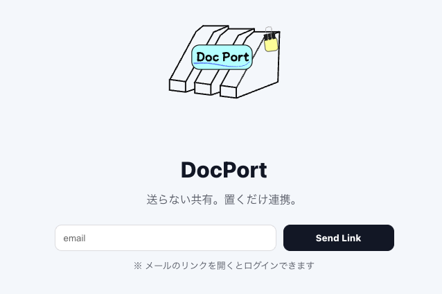
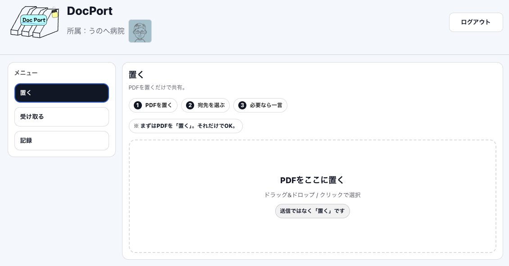

  

# Doc Port（病院間ドキュメント共有支援システム）

**送らない共有。置くだけ連携。**

DocPort は、病院間での FAX・電話・紙に依存した情報共有を置き換えるための  
**病院専用・シンプルなドキュメント共有 Web アプリ**です。

---

## 主な機能

  

### 置く

- PDFをドラッグ＆ドロップで配置
- 宛先病院を選択して「置く」だけ
- 誰に送るか・いつ送るかを考えない設計

### 受け取る

- 自院宛ての資料を一覧表示
- 未読 / 既読 / 期限切れ / 取消 を色分け表示
- PDFはクリックで即時確認

### 記録

- 自院が置いた履歴を一覧で確認
- 未読・期限内であれば取り消し可能
- 「確認されたかどうか」が状態で分かる

---

## 技術構成

- フロントエンド：React / Vite
- 認証・DB：Supabase（Auth / PostgreSQL）
- ストレージ：Cloudflare R2

---

## 今後の展望

- Word等の自動PDF変換
- AIによるPDF要約・宛先病院候補提案
- 病院内権限分離
- 監査ログの拡張
